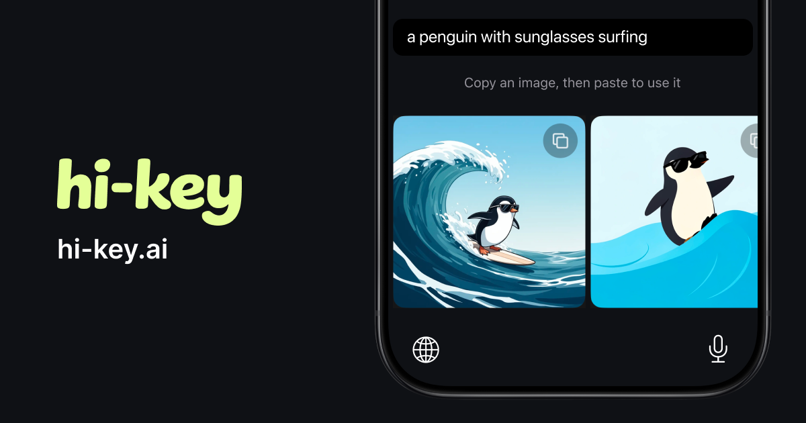
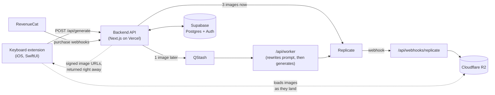

# hi-key

**AI images, right from your iPhone keyboard.** Type an idea in any app (iMessage, WhatsApp, Instagram DMs, anything with a text field), tap generate, and get 4 images back in seconds, ready to paste into the conversation.

[App Store](https://apps.apple.com/app/id6762464437) · [hi-key.ai](https://hi-key.ai)



This is the full source of a live product built by one person: the iOS app with its custom keyboard extension, the backend API, and the marketing website, all in one repo.

## How it works



1. The keyboard sends the prompt with the user's Supabase JWT (anonymous auth, so there's no signup).
2. `/api/generate` reserves credits, writes 4 generation rows, and starts 3 image generations on Replicate right away. It runs prompt proofreading, style detection and moderation in parallel instead of one after another. The 4th image goes through QStash to a background worker that rewrites the prompt more creatively first.
3. The response goes out immediately with **pre-signed R2 URLs for images that don't exist yet**. The keyboard shows placeholders and fills each one in as the Replicate webhook uploads the finished image.
4. Credits are debited up front. Webhooks refund failed images and any difference between the reserved and actual model cost afterwards, so none of that work sits in the request path.

### Speed is the product

The whole design follows one rule: every step on the `/api/generate` path has to justify the time it adds. Work runs in parallel wherever possible. Rare cases (moderation hits, failures, refunds) are handled after the fact, even if that costs more, so the common case stays fast. The keyboard also calls `/api/warmup` as soon as it opens, so serverless cold starts are already paid for by the time the user taps generate.

## Repository layout

| Path | What | Stack |
|---|---|---|
| [`backend/`](backend/) | Headless API at `app.hi-key.ai`: generation, credits ledger, purchase and generation webhooks, referrals, privacy cleanup cron | Next.js 16 (route handlers only), TypeScript, Supabase, Replicate, OpenAI, Cloudflare R2, Upstash QStash, RevenueCat |
| [`ios/`](ios/) | The iOS app (`hi`: onboarding, paywall, settings) and the keyboard extension (`hi-keyboard`) | Swift, SwiftUI, [KeyboardKit](https://keyboardkit.com), Supabase Swift, RevenueCat, Lottie, Sentry, PostHog |
| [`website/`](website/) | Marketing site at [hi-key.ai](https://hi-key.ai) | Next.js 16 (fully static), Tailwind CSS v4, shadcn/ui |

The three parts share no code. The contract between them is the HTTP API: request and response types live in `backend/app/api/*` and are mirrored in `ios/hi/APIClient.swift`.

## Highlights

- **Credits ledger in Postgres.** An append-only `credit_transactions` table with `(reason, source_id)` uniqueness makes every grant, debit and refund idempotent, so webhook retries are safe. Balance changes happen inside PL/pgSQL functions with row locks, so two concurrent generations can't both spend the same credits. See [`backend/supabase/migrations/`](backend/supabase/migrations/).
- **Two credit buckets.** Weekly subscription credits reset on renewal; pack and referral credits never expire. Refunds go back to the bucket the credits came from.
- **Layered moderation.** A synchronous blocklist before anything else runs, then OpenAI moderation in parallel with the generation setup, then the providers' own safety filters.
- **Short retention.** Prompts and images are deleted within an hour by a cron job ([`backend/lib/cleanup/`](backend/lib/cleanup/)), with an R2 lifecycle rule as a backstop.
- **A keyboard extension that behaves.** It shares auth with the main app through an App Group, stays visually neutral inside other apps, and still works as a normal keyboard when Full Access (needed for network requests) is off.

## Running it

Each project runs on its own. See the project's `CLAUDE.md` for details.

```bash
# Backend: needs your own Supabase, Replicate, OpenAI, R2, QStash, RevenueCat keys
cd backend && cp .env.example .env.local && npm install && npm run dev

# Website
cd website && npm install && npm run dev

# iOS: open in Xcode (iOS 26+), dependencies resolve via Swift Package Manager
open ios/hi.xcodeproj
```

The iOS app points at the production backend and Supabase project. Change `ios/hi/APIClient.swift` and `ios/hi/SupabaseManager.swift` to point it at your own. The keys in the app (Supabase publishable key, RevenueCat, PostHog, Sentry DSN) are client-side keys that ship in the App Store binary anyway. Everything that matters is enforced on the server.

## Working on it with an AI agent

The repo is set up for [Claude Code](https://claude.com/claude-code). The root [`CLAUDE.md`](CLAUDE.md) explains the product and how the parts fit together, and each project has its own `CLAUDE.md` with its conventions. Point your agent at the repo and it has the context it needs.

## Status

This repo is public as a showcase and so friends can see how it's built. I'm not looking for contributions, but you're welcome to fork it, run it and build on it.

## License

[MIT](LICENSE). The license covers the code. The hi-key name, logo and brand assets are not included in the grant.
